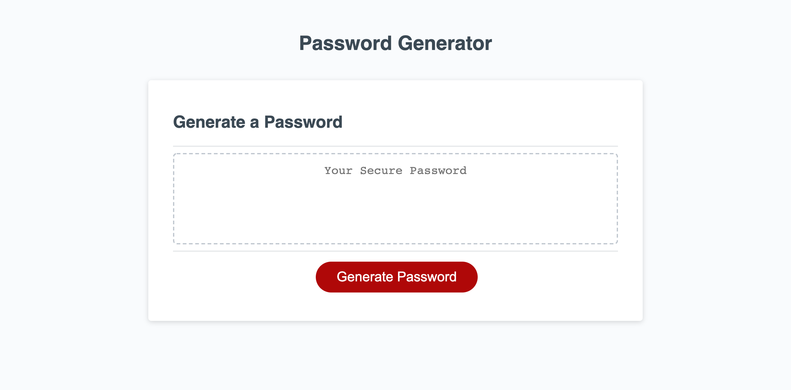

# Password Generator

## Main Challenge
The biggest challenge that I had come accross in this project was making sure the selected criteria are included into a generated password. It seems like there is something I am missing from the middle to concatenate the necessary arrays to pull from. Nonetheless, this was a great challenge that I'm looking forward to figure out through some extra work and tutoring. 

I can see this being applied to my ideal work environment as a music educator to create a random note generator for students to practice note reading. 

https://cah4758.github.io/password-generator/
[Deployed App Link]

